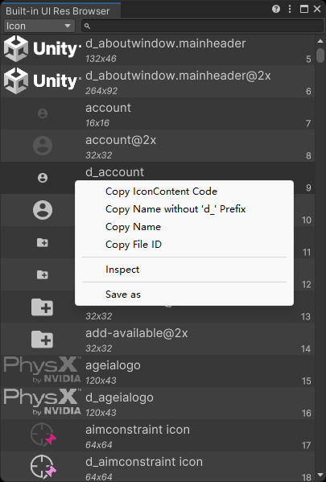

# Unity Editor内置UI资源浏览器 Unity Editor Built-in UI Resources Browser

浏览Unity Editor内置的UI资源。 
Browse the Unity Editor built-in UI resources.

## 支持的Unity版本 Supported Unity Version

Unity 2019.4及更新版本。 
Unity 2019.4 and later.

## 安装方法 Installation

从 [OpenUPM](https://openupm.com/packages/com.greenbamboogames.builtinuiresbrowser) 安装此插件，或者直接克隆此仓库到项目中。
Install this package via [OpenUPM](https://openupm.com/packages/com.greenbamboogames.builtinuiresbrowser), or clone this repository directly into the Packages folder of your project.

## 如何使用 How to use

从工具栏菜单 **Tools/Bamboo/Editor Icons Overview** 打开工具窗口。 
Open the Editor Icons Overview window from the menu **Tools/Bamboo/Editor Icons Overview**.

左键双击条目，可以在Inspector中检视该条目。 
Double-click on an entry to inspect it in the Inspector.

右键点击图标条目，可以复制图标名字或代码（Unity会自动根据主题为图标追加 `d_` 前缀）。 
Right-click on an icon entry to copy the icon name or code (Unity will automatically append `d_` prefix based on the theme).

右键点击StyleSheet和VisualTreeAsset条目，可以复制资产名字、代码或将其导出。 
Right-click on a StyleSheet or VisualTreeAsset entry to copy the asset name, code or export it.

---

**Thanks to [halak/unity-editor-icons](https://github.com/halak/unity-editor-icons)** .
